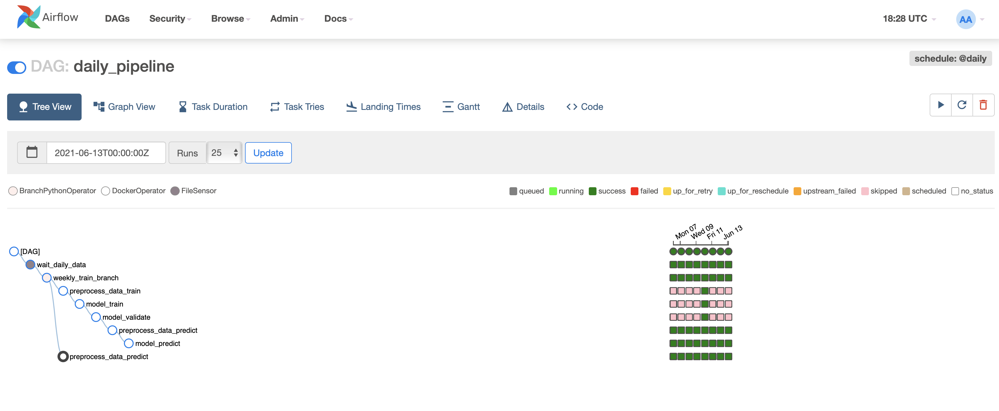
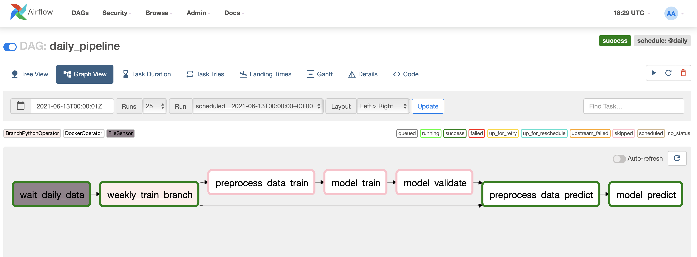

# Оффлайн инференс модели на Airflow

### Описание
Легенда: 
1) Откуда-то берутся данные... (_dag_id data_generator_)
2) Еженедельно, мы переобучаем модель на новых данных. (_weekly_train_branch_operator + model_train + model_validate_) 
3) Ежедневно, текущая, выбранная нами модель, скорит данные и записывает предсказания куда-то (_FileSensor + model_predict_)
4) Эти предсказания используют -- все счастливы

### Запуск
```bash
  export FERNET_KEY=$(openssl rand -base64 24) \
      && export LOCAL_DATA_PATH=$(pwd)/data \
      && docker-compose up --build
```

### Результаты
_**Список всех запусков**_


_**Граф с пропуском этапа обучения**_

