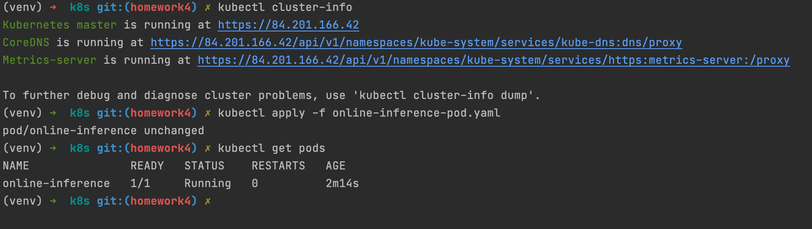
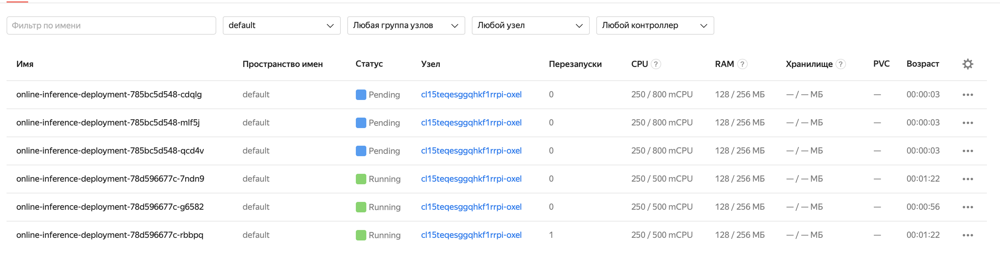
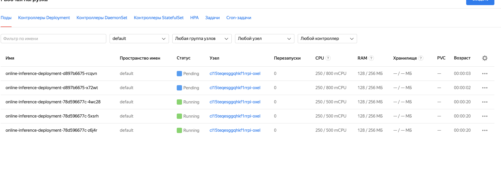

# Деплоймент модели с помощью Kubernetes

### Описание
Легенда: 
1) Есть микросервис с моделью
2) Хотим безболезненно поднмать несколько инстансов с моделью в зависимости он нагрузки на API 
3) Хотим контролировать ресурсы/версию/ошибки/статус модели в проде
4) При ошибках нужно безболезненно переключиться на предыдущую версию

### Запуск
- Создаем k8s сервер на [YandexCloud](https://cloud.yandex.ru/services/managed-kubernetes)
- Устанавливаем [kubectl](https://kubernetes.io/docs/tasks/tools/)
- `kubectl apply -f online-inference-pod.yaml` - для деплоймента
- `kubectl delete -f online-inference-pod.yaml` - для удаления
- `kubectl get pods` - список активных подов

### Результаты
- 1 ) _**YandexCloud interface**_

- 2 ) _**Запуск базового Pod'a**_

- 2а ) Зачем нужны requests/limits?
  * _**resources**_: В случае если k8s запущен на нескольких машинах, Pod'ы пожнимутся на более свободной машине или на той машине куда помещается Pod.
  * _**limits**_: Если Pod начинает кушать ресурсов больше чем нужно keeper убьет Pod.
    
- 3 ) На что влияют liveness и readiness пробы:
  * _**readinessProbe**_: - проверка статуса Ready (ping по get /health) для Pod'а.
  * _**livenessProbe**_: - поддержание Pod'а в "живом" состоянии (через статус Ready) и перезапуск в случае failureThreshold ошибок подряд
  * _**startupProbe**_: - контроль статуса Ready при поднятии контейнера и переподняте в случае failureThreshold ошибок подряд, задержку проверок можно задать через initialDelaySeconds
    
- 4 ) что будет, если сменить докер образа в манифесте и одновременно с этим:
    * а) уменьшить число реплик? часть Pod'ов отключится, версия не изменится 
    * б) увеличить число реплик? поднимутся новые Pod'ы, с новой версией

- 5 ) Играя с параметрами деплоя(maxSurge, maxUnavaliable), добейтесь ситуации, когда при деплое новой версии:
    * a) Есть момент времени, когда на кластере есть как все старые поды, так и все новые (maxSurge: 100%, maxUnavailable: 0%)
      
    * б) Одновременно с поднятием новых версии, гасятся старые (maxSurge: 60%, maxUnavailable: 30%)
      